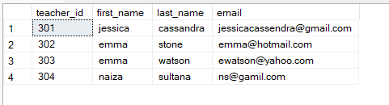

# Assignment-1

1. Write an SQL query to insert a new student named John Doe into the "Students" table.

query:

```sql
insert into students(student_id,first_name,last_name,date_of_birth,email,Phone_number)
values
      (107,'John','Doe','2000-04-14','johndoe@gmail.com',9177483720);
```

output:


2.Write an SQL query to enroll an existing student in a course, specifying the enrollment date.

query:

```sql
insert into enrollments values(408,107,201,'2024-04-14');
```

output:


3. Update the email address of a teacher in the "Teachers" table.

query:

```sql
update teachers
set email = 'jessicacassendra@gmail.com'
 where teacher_id=301;
```

output:



4. Write an SQL query to delete a specific enrollment record, choosing based on the student and course.

query:

```sql
delete from enrollments
 where student_id=101 and course_id=203;
```

output:


5. Update a course to assign a specific teacher using the "Courses" table.

query:

```sql
update courses
set teacher_id=302
where course_id=201;
```

output:


6. Write an SQL query to calculate the total payments made by a specific student.

query:

```sql
select *from payments where student_id=102;
```

output:


7. Retrieve a list of courses along with the count of students enrolled in each.

query:

```sql
select course_name,count(student_id) as Total_enrolls from courses as c
inner join enrollments as e
on c.course_id=e.course_id group by course_name;
```

output:


8. Find the names of students who have not enrolled in any course.

query:

```sql
select  CONCAT(first_name,' ',last_name) as Student_name  from students as e left join enrollments as s
on e.student_id = s.student_id where enrollment_id is null;
```

output:


9. Retrieve the first name and last name of students, along with the names of the courses they are enrolled in.

query:

```sql
select first_name,last_name,course_name from students as s
inner join
enrollments as e
on s.student_id=e.student_id inner join courses as c on e.course_id=c.course_id;
```

output:


10. List names of teachers and the courses they are assigned to.

query:

```sql
select CONCAT(first_name,' ',last_name) as Teacher_name ,course_name
from courses as c
inner join
teachers as t
on c.teacher_id=t.teacher_id;
```

output:


11. Calculate the average number of students enrolled in each course using aggregate functions and subqueries.

query:

```sql
select AVG(count1) as count
from (select count(student_id) as count1
from enrollments group by course_id)
as temp_table;
```

output:


12. Identify the student(s) who made the highest payment using a subquery.

query:

```sql
select student_id from payments where amount =
(select max(amount) from payments);
```

output:


13. Retrieve a list of courses with the highest number of enrollments using subqueries.

query:

```sql
select course_id from courses
where course_id in
(select course_id from enrollments group by course_id
 having COUNT(student_id)=
(select max(count) from (select count(student_id) as count
from enrollments group by course_id)as temp_table));
```

output:


14. query:

```sql
select teacher_id,(select SUM(amount) from payments as p where p.student_id in
(select e.student_id from enrollments e where e.course_id in
(select c.course_id from courses c where c.teacher_id=t.teacher_id))) as total from teachers as t
```

output:


15. Identify students who are enrolled in more than one course.

query:

```sql
select student_id from enrollments
group by student_id having
COUNT(student_id)>1;
```


